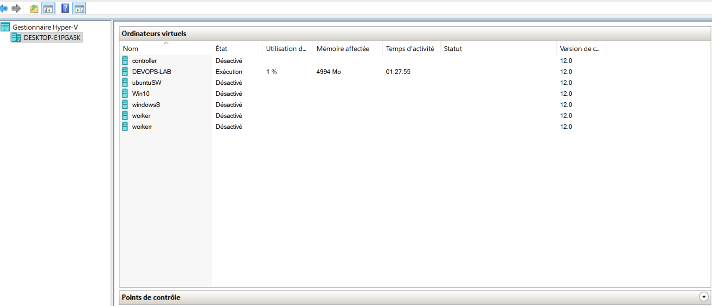
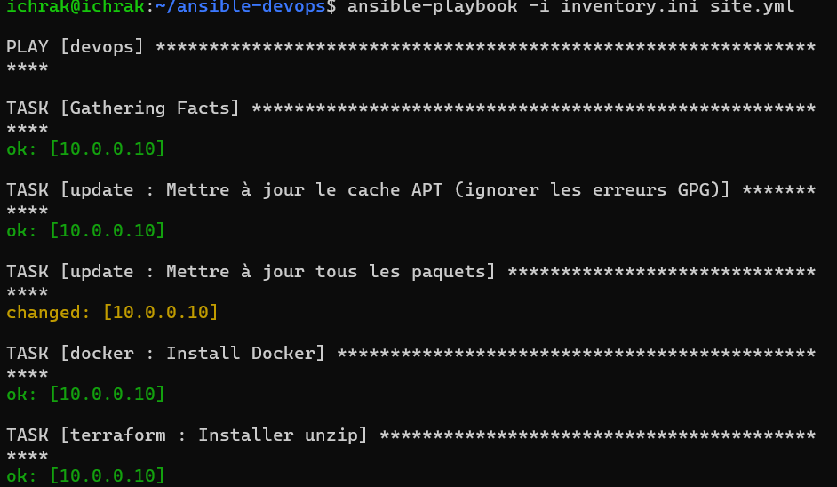
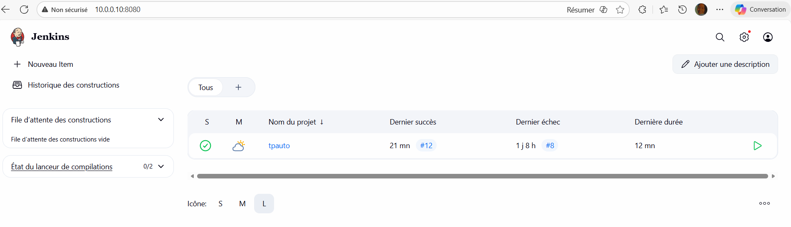
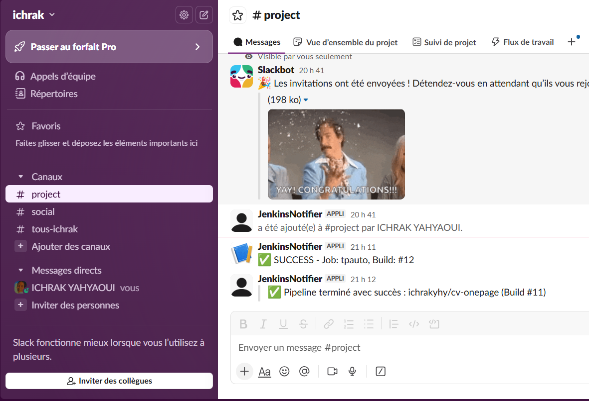
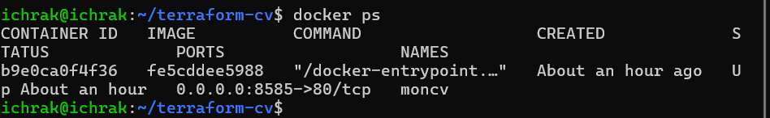
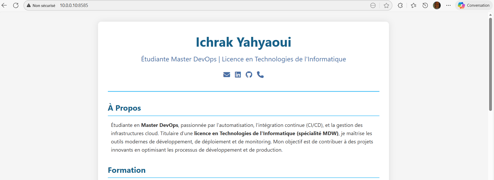
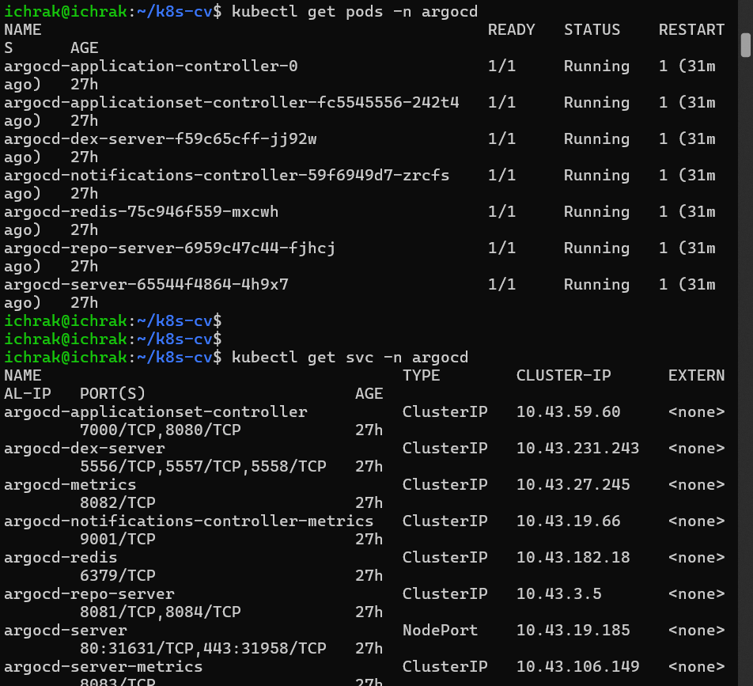
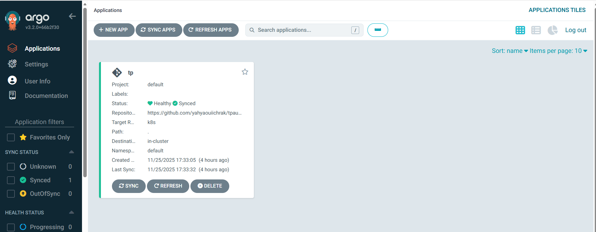

# TP DevOps : Mise en place d’une chaîne CI/CD complète avec Monitoring Grafana Cloud

## 1. Introduction
Ce projet consiste à concevoir et mettre en œuvre une chaîne CI/CD complète pour automatiser et accélérer le cycle de développement logiciel. Les outils utilisés sont : **Ansible**, **Docker**, **Terraform**, **Jenkins**, **Kubernetes (K3s)**, **Argo CD**, et **Grafana Cloud**.

Objectifs :
- Automatiser l’installation des outils via Ansible (avec Ansible Galaxy pour les rôles).
- Créer un pipeline CI/CD avec Jenkins.
- Déployer une application statique (CV One Page) avec Docker et Terraform.
- Orchestrer le déploiement avec K3s et Argo CD.
- Mettre en place un monitoring complet avec Grafana Cloud.

---

## 2. Pré-requis
- VM Ubuntu Server 24.04 nommée `DEVOPS-LAB`
- Accès SSH configuré
- Compte Grafana Cloud
- Compte Docker Hub
- GitHub pour héberger le code source et les scripts

---

## 3. branchs
```
ansible          # Playbooks et rôles Ansible
terraform        # Scripts Terraform
k8s              # Manifests Kubernetes
main             # Pipeline CI/CD

```

---

## 4. Étapes détaillées

### Partie I : Préparation de l’environnement
```bash
sudo apt update && sudo apt upgrade -y
```
Configurer SSH et accès à la VM.

### Partie II : Automatisation avec Ansible
Utilisation d’**Ansible Galaxy** pour installer les rôles :
```bash
ansible-galaxy install roles/docker
ansible-galaxy install roles/terraform
ansible-galaxy install roles/jenkins
```
Exécution des playbooks :
```bash
ansible-playbook -i inventory.ini site.yml
```


### Partie III : Pipeline CI/CD avec Jenkins
Pipeline pour :
- Récupérer le code GitHub
- Construire l’image Docker
- Pousser sur Docker Hub
- Notifier via Slack




### Partie IV : Déploiement avec Terraform
```bash
terraform init
terraform plan
terraform apply 
```
Déploiement d’un conteneur Docker basé sur l’image CV.




### Partie V : Orchestration avec K3s et Argo CD
Installation K3s :
```bash
curl -sfL https://get.k3s.io | sh
```
Déploiement via Argo CD :
- Deployment (2 replicas)
- Service NodePort



### Partie VI : Monitoring avec Grafana Cloud

#### Installation Node Exporter
```bash
curl -LO https://github.com/prometheus/node_exporter/releases/download/v1.7.0/node_exporter-1.7.0.linux-amd64.tar.gz
tar xvf node_exporter-1.7.0.linux-amd64.tar.gz
sudo mv node_exporter-1.7.0.linux-amd64/node_exporter /usr/local/bin/
```
Création du service :
```ini
[Unit]
Description=Node Exporter
After=network.target

[Service]
ExecStart=/usr/local/bin/node_exporter
Restart=always

[Install]
WantedBy=multi-user.target
```

#### Activer métriques Docker
```json
{
  "metrics-addr": "0.0.0.0:9323",
  "experimental": true
}
```
Redémarrer Docker :
```bash
sudo systemctl restart docker
```

#### Installer Grafana Alloy
Commande fournie par Grafana Cloud :
```bash
GCLOUD_HOSTED_METRICS_ID="2823269" GCLOUD_HOSTED_METRICS_URL="https://prometheus-prod-58-prod-eu-central-0.grafana.net/api/prom/push" GCLOUD_HOSTED_LOGS_ID="1407311" GCLOUD_HOSTED_LOGS_URL="https://logs-prod-039.grafana.net/loki/api/v1/push" GCLOUD_FM_URL="https://fleet-management-prod-024.grafana.net" GCLOUD_FM_POLL_FREQUENCY="60s" GCLOUD_FM_HOSTED_ID="1449518" ARCH="amd64" GCLOUD_RW_API_KEY="TON_TOKEN" /bin/sh -c "$(curl -fsSL https://storage.googleapis.com/cloud-onboarding/alloy/scripts/install-linux.sh)"
```

#### Configuration Alloy corrigée
```hcl
prometheus.remote_write "metrics_service" {
    endpoint {
        url = "https://prometheus-prod-58-prod-eu-central-0.grafana.net/api/prom/push"
        basic_auth {
            username = "2823269"
            password = sys.env("GCLOUD_RW_API_KEY")
        }
    }
}

prometheus.scrape "node" {
    targets = ["localhost:9100"]
}

prometheus.scrape "docker" {
    targets = ["localhost:9323"]
}
```

Redémarrer Alloy :
```bash
alloy check-config /etc/alloy/config.alloy
sudo systemctl restart alloy.service
```

Vérifier dans Grafana Explore :
```
node_cpu_seconds_total
engine_daemon_container_states_running
```

---


---

## 8. Conclusion
Ce TP met en œuvre une chaîne DevOps complète avec CI/CD, Infrastructure as Code, orchestration Kubernetes et monitoring avancé via Grafana Cloud.
